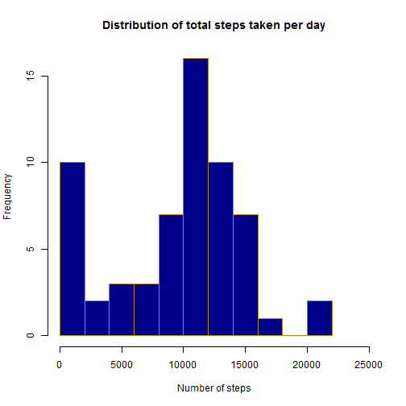
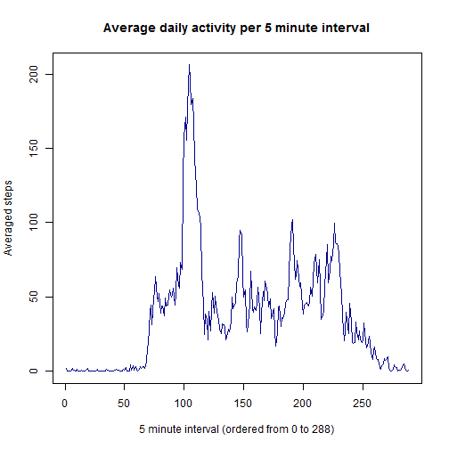
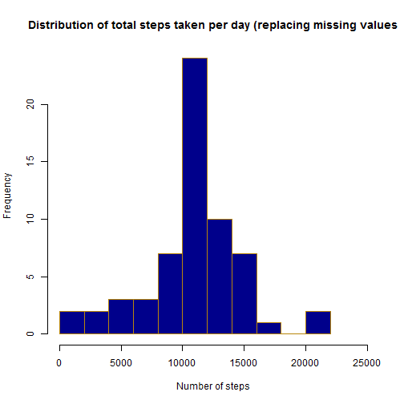
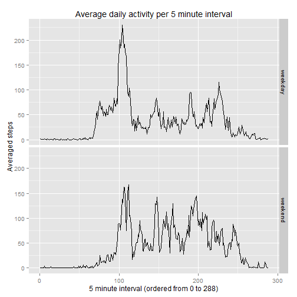

This document is the 1st programming assignment for the course *Reproducible Research* of the Coursera Specialization in Data Science.

Based on data collected by a activity-measuring wearable device, a few answers on daily activity trends are presented in this report.

###Required packages downloaded:
*For the completion of this project, the user needs to have downloaded to his/her computer `dplyr` and `ggplot2`.*

##Loading and Preprocessing the data

With the dataset already downloaded in the working directory and with the name of `activity.csv`, we proceed to load it into the R.


```r
alldata <- read.csv("activity.csv")
head(alldata)
```

```
##   steps       date interval
## 1    NA 2012-10-01        0
## 2    NA 2012-10-01        5
## 3    NA 2012-10-01       10
## 4    NA 2012-10-01       15
## 5    NA 2012-10-01       20
## 6    NA 2012-10-01       25
```

We see the dataset includes number of steps measured every 5 minutes during several days.
To answer the next questions, data is sufficiently well organized to work with.

##What is mean total number of steps taken per day?

In order to get a sense on how the data is structured, we print a histogram of how what is the ususal value of total daily steps taken by the user.
We use the new data frame summdata, including the total of steps taken per day.


```r
library(dplyr)
```

```r
summdata <- summarise(group_by(alldata, date), totsteps = sum(steps, na.rm=T))

hist(summdata$totsteps, breaks=10, col="darkblue", border="darkgoldenrod",
     xlim=c(0,25000), main="Distribution of total steps taken per day",
     xlab="Number of steps")
```

 

Based on the daily sum of steps, we can obtain the **mean** and **median** of such values.


```r
mean(summdata$totsteps)
```

```
## [1] 9354.23
```

```r
median(summdata$totsteps)
```

```
## [1] 10395
```

##What is the average daily activity pattern?

To answer the question, we will plot the value of activity for every 5 minute interval, averaged along all days measured (and ignoring missing values).
Since there are 288 5-minute interval per day, values on the *x* axis will range from 0 (just after midnight) to 288 (right before midnight).


```r
daypattern <- summarise(group_by(alldata, interval),
                        dailyac = mean(steps, na.rm=T))

daypattern$intervalnum <- rownames(daypattern)

plot(daypattern$intervalnum, daypattern$dailyac, type="l", 
     xlab="5 minute interval (ordered from 0 to 288)", ylab="Averaged steps",
     main="Average daily activity per 5 minute interval", col="darkblue")
```

 

We can see a peak of activity after interval *100*, meaning after 8:15am.

The maximum value averaged for all days is obtained for exactly the interval *104*, corresponding 8:35am (presumably either morning gym or running to catch the bus!).


```r
daypattern[which(daypattern$dailyac==max(daypattern$dailyac)),]
```

```
## Source: local data frame [1 x 3]
## 
##   interval  dailyac intervalnum
## 1      835 206.1698         104
```

##Imputing missing values

Up to this moment, all computations have taken place ignoring all missing values in the dataset.

- First, we will see how many activity measurements have failed and are counted as `NA`.


```r
sum(complete.cases(alldata))
```

```
## [1] 15264
```

- Now, in order to fill those gaps, we are going to assume that the activity performed in each 5-minute interval whose data is missing is going to be the same as the activity of the average of the same 5-minute interval computed for the rest of the days, and this information is going to be stored in a new column called **`allvalues`**. As an example, if we do not have information about the number of steps taken at 6:00am one particular day, we will asume that it is equivalent to the number of steps ususally taken every morning at 6:00am.


```r
alldata2 <- left_join(alldata, daypattern, by="interval")
alldata2 <- mutate(alldata2, allvalues=0)
alldata2$allvalues <- ifelse(is.na(alldata2$steps),alldata2$dailyac,
                             alldata2$steps)
head(alldata2)
```

```
##   steps       date interval   dailyac intervalnum allvalues
## 1    NA 2012-10-01        0 1.7169811           1 1.7169811
## 2    NA 2012-10-01        5 0.3396226           2 0.3396226
## 3    NA 2012-10-01       10 0.1320755           3 0.1320755
## 4    NA 2012-10-01       15 0.1509434           4 0.1509434
## 5    NA 2012-10-01       20 0.0754717           5 0.0754717
## 6    NA 2012-10-01       25 2.0943396           6 2.0943396
```

This new dataset (`alldata2`) takes the number of steps of the original one if those are measured, or the averaged one (calculated in the previous section) if it is a missing value, placing it in `allvalues`.

- To see how the new data is distributed, we plot another histogram with frequency of steps measured.


```r
summdata2 <- summarise(group_by(alldata2, date),
                       totsteps2 = sum(allvalues, na.rm=T))
hist(summdata2$totsteps2, breaks=10, col="darkblue", border="darkgoldenrod",
     xlim=c(0,25000),
     main="Distribution of total steps taken per day (replacing missing values",
     xlab="Number of steps")
```

 

In this graph we can see how all the ocurrences that in the first plot were showing no activity at all now are distributed among all values, and because they are mean values, they tend to group in the areas where frequencies were already higher before (at the center of the plot).

- With the new set of data, **mean** and **median** values can be recalculated.


```r
mean(summdata2$totsteps2)
```

```
## [1] 10766.19
```

```r
median(summdata2$totsteps2)
```

```
## [1] 10766.19
```

Due to the inclusion of the missing values, both mean and median are not only higher, but also equivalent.

##Are there differences in activity patterns between weekdays and weekends?

In order to see how activity trends differ between weekdays and weekends, we will plot averaged activity versus 5-minute periods.

To do that, it is necessary to create new variables accounting for which day of the week corresponds to each of the dates where measurements were taken and then group those values between *weekdays* and *weekends*.


```r
Sys.setlocale("LC_TIME","English")
```

```
## [1] "English_United States.1252"
```

```r
alldata2$dayofweek <- weekdays(as.POSIXct(alldata2$date))
alldata2$daytype <- ifelse(alldata2$dayofweek=="Saturday" |
                                 alldata2$dayofweek=="Sunday",
                           "weekend", "weekday")
```

*(Note): since my computer has its system language set to Spanish, it is necessary to include a line of code to ensure weekdays are displayes in English.*

With the data properly grouped between weekdays and weekends, with `ggplot2` we can confront both trend lines.


```r
alldata2$daytype <- as.factor(alldata2$daytype)
alldata2$intervalnum <- as.numeric(alldata2$intervalnum)
daypattern2 <- summarise(group_by(alldata2, intervalnum, daytype),
                        dailyac2 = mean(allvalues, na.rm=T))

library(ggplot2)
g <- ggplot(daypattern2, aes(intervalnum,dailyac2, group=daytype)) + geom_line()
g + facet_grid(daytype ~. ) + 
      labs(title="Average daily activity per 5 minute interval",
         x="5 minute interval (ordered from 0 to 288)", y="Averaged steps") 
```

 

With the two trends plotted, we can extract a few conclusions:
1. The user wakes up earlier on weekdays than on the weekend.
2. The user goes to sleep earlier on weekdays than on weekends.
3. Activity on weekdays is quite focused on the mornings (probably early gym or long commute) while on weekends is slightly more distributed along the day.


